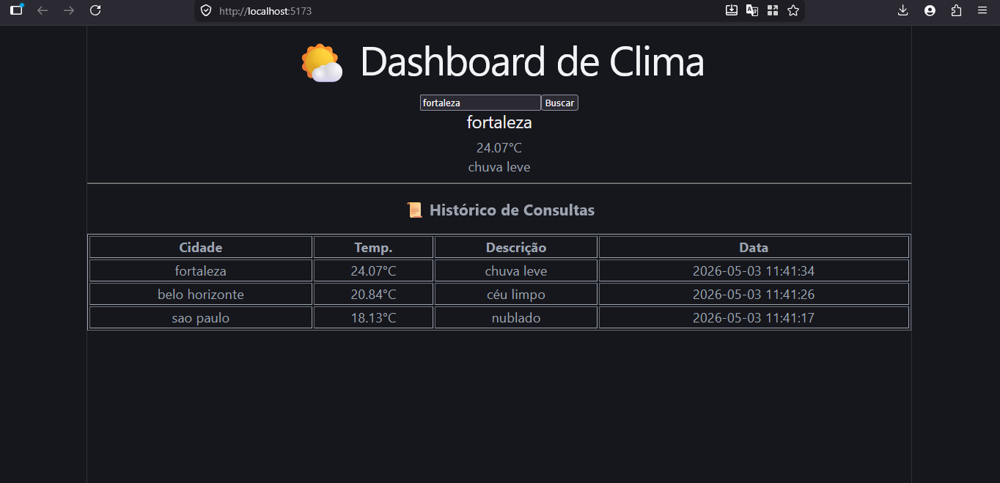
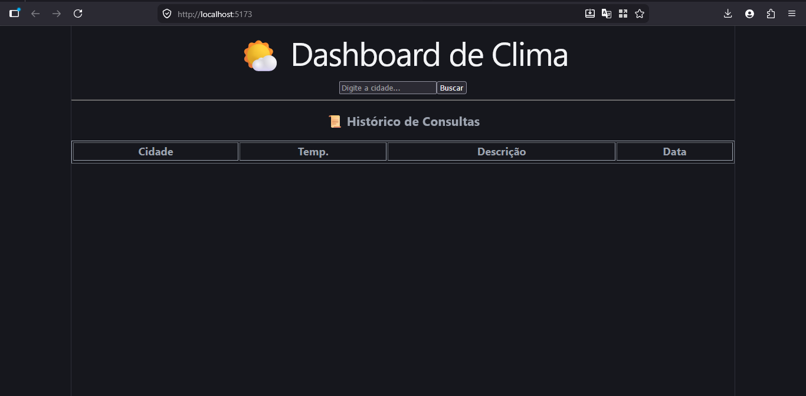
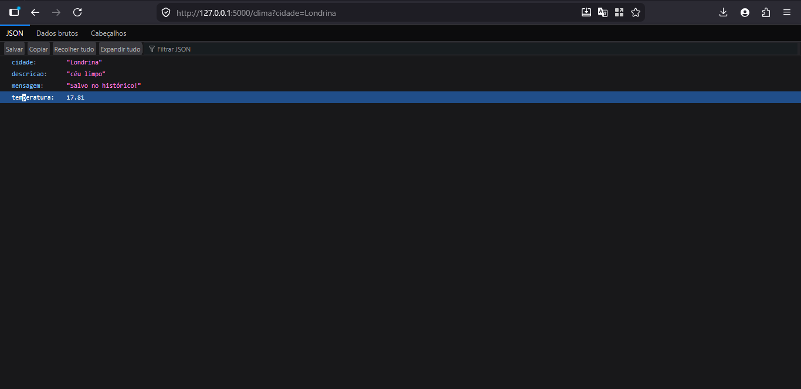

# 🌤️ Dashboard de Clima com Histórico (Full Stack)

Este projeto é um sistema completo de monitoramento meteorológico. Ele permite que o usuário pesquise o clima em tempo real de qualquer cidade do mundo, armazena essa consulta em um banco de dados SQL e exibe um histórico organizado das últimas buscas.

## 📸 Demonstração do Projeto

### 1. Interface Principal e Busca
Abaixo, a tela inicial do sistema desenvolvida em **React**, mostrando o card de clima atualizado após a busca.

### 2. Estado Inicial
A aplicação conta com um estado limpo para a primeira interação do usuário.

### 3. Comunicação via API (JSON)
O backend em **Python** processa os dados e os entrega de forma estruturada, facilitando a integração entre os sistemas.

---

## 🛠️ Tecnologias e Ferramentas

*   **Linguagem:** Python 3 (Backend) e JavaScript (Frontend).
*   **Framework Web:** Flask (Criação das rotas da API).
*   **Banco de Dados:** SQLite com SQLAlchemy (ORM para persistência de dados).
*   **Interface:** React.js com Vite (Componentização e reatividade).
*   **Consumo de API:** OpenWeatherMap API para dados climáticos reais.

---

## 🧠 O que este projeto demonstra?

Este projeto foi construído para colocar em prática conceitos fundamentais de engenharia de software:

*   **Arquitetura Cliente-Servidor:** Separação clara entre a interface (Frontend) e a lógica de negócios (Backend).
*   **Persistência de Dados:** Uso de SQL para garantir que as informações não sejam perdidas ao fechar o navegador.
*   **Integração de APIs:** Capacidade de consumir serviços externos e tratar respostas JSON.
*   **CORS:** Configuração de segurança para permitir a comunicação entre domínios diferentes (Porta 5173 para 5000).

---

## 🚀 Como rodar o projeto localmente

### Pré-requisitos
*   Python 3.x instalado.
*   Node.js e NPM instalados.

### Passo 1: Configurar o Backend
1. No terminal, instale as bibliotecas necessárias:
    pip install flask flask-sqlalchemy flask-cors requests
   
2. Inicie o servidor Python:
    python app.py

### Passo 2: Configurar o Frontend
1. Em um novo terminal, entre na pasta do frontend:
    cd frontend

2. Instale as dependências:
    npm install

3. Inicie a aplicação:
    npm run dev

Desenvolvido por Ramon - Portfólio de Programação 2026